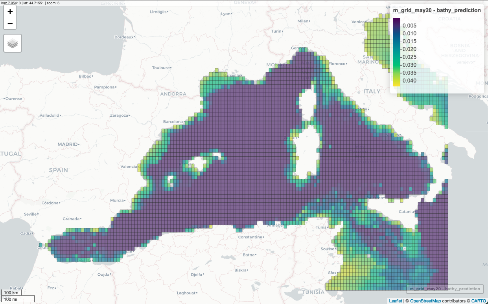
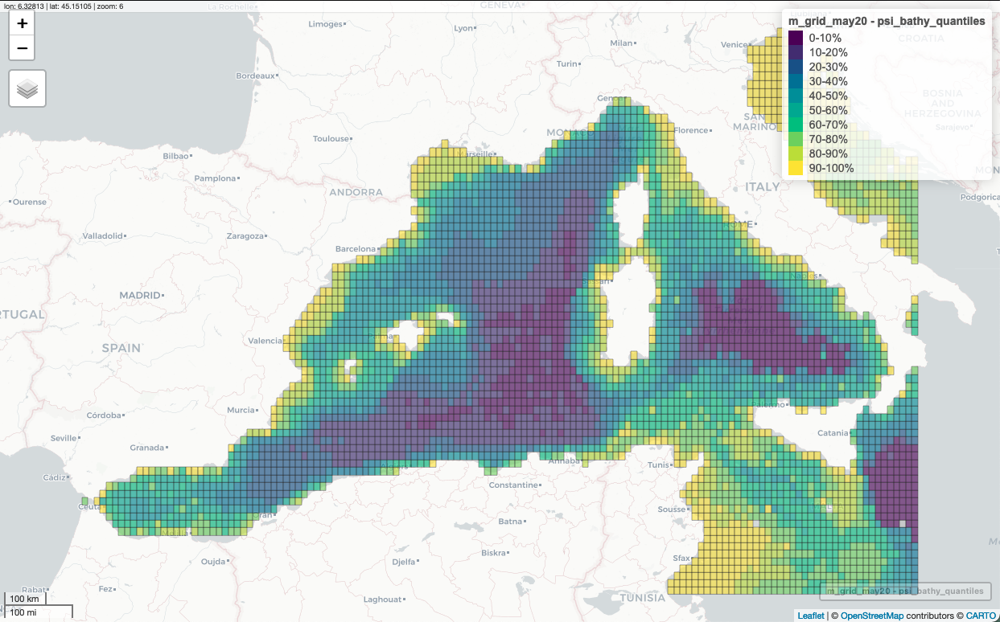
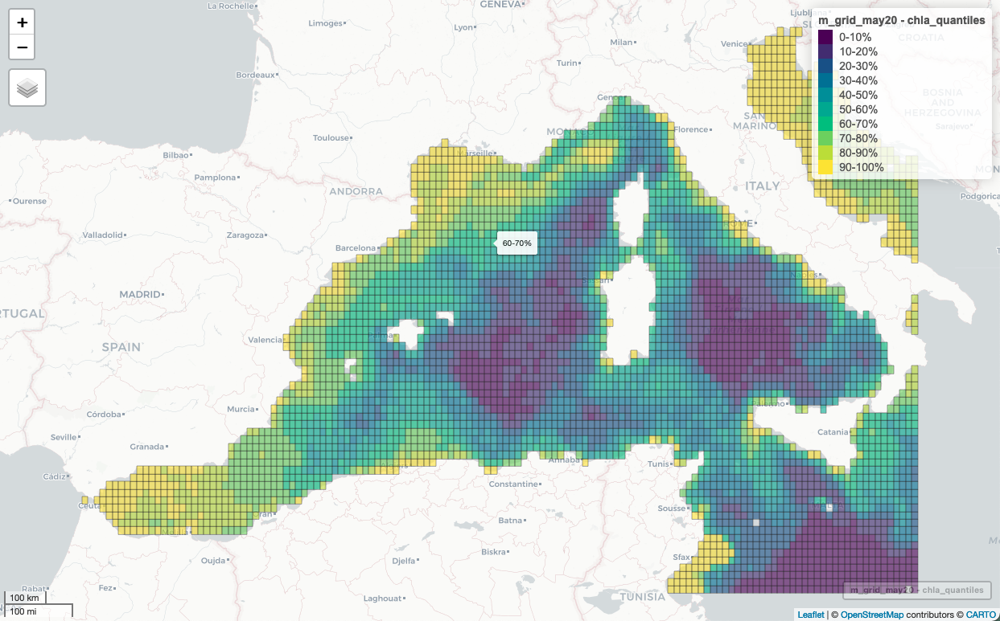

```{r setup, include=FALSE}
knitr::opts_chunk$set(echo = TRUE, warning = FALSE, message = FALSE)
```


### A bit of background context

The data I'll be using here are a subset of a larger database of observations of marine fauna sampled over 12+ years in the Mediterranean Sea by a citizen science programm in France called Cybelle Mediterranee. The program is run by a non-profit organisation called Cybelle Planete, and they co-developed a free app called ObsEnMer so that anyone can use it to upload their observations and geolocate them. The whole dataset with many more variables can be dowloaded from their [website](https://www.obsenmer.org/), but you must create a profile which has to be validated before you have access to the data, and that may take a while.

I've created a subset of these data that I've processed (selected relevant columns, renamed them in english, etc), and I'll happily send it to you. Simply contact me at camille.coux@orange.fr, and let me know what you intend to do with the data.

### Experimental design

They have different sampling designs, and here I'll be using the more advanced ones. In this case, observations were collected by volunteers. They sign up for week-long sampling sessions on a sailing boat and are supervised by a trained "ecoguide", since most volunteers have no prior experience in marine animal identification, nor any particular skills in ecology, biology, oceanography or even sailing. 

Observations are thus collected following random transects, i.e. a linear trajectory at a fixed speed, that lasts for at least 15 minutes, but can last several hours. Mainly because of weather and technical issues, these transects do no aim to be resampled more than once, but may very well overlap or cross trajectories over different sessions. While sampling occurs, the aim is to log in any sightings of marine fauna that ca be seen from the surface. Species are mainly cetaceans and birds, but also turtles, fish, macroplancton (mainly jellyfish), rays and a couple species of shark. Data are collected at regular time intervals, such that even when no animals are to be seen, a record is still logged into the dataset and hence corresponds to an absence (NA in the dataset). However, if an animal is detected, the observation is recorded even if the sighting happens in beteen 2 time intervals.

### Environmental data

In addition to the observation data, I've also compiled measures of bathymetry, chlorophyll a concentration, and sea surface temperature from [GEBCO](https://download.gebco.net/) for bathymetry, and [oceancolor](https://oceancolor.gsfc.nasa.gov), for the latter 2. 

To get the raw data, you may visit these websites (or orther hubs like [Corpenicus](https://marine.copernicus.eu) for instance) and dowload them or file a request when necessary.

I also created a grid over the NW Mediterranean basin for the purpose of this analysis.

All files are necessary to run this analysis, and as for the other variables, I can send the processed versions I used for this analysis along with the observation data.


### Let's get started

The aim is to conduct an occupancy analysis, and produce a number of maps to viualise the predictions. In this example, I'll be processing the data and formatting it for the unmarked framework used to run the analysis. 

Then we'll run a occupancy model. It's not super well tailored for our kind of data as we'll see later on, so I'll pass really quickly over the whole analysis part to go straight to the outputs.


```{r, message=FALSE}
library(magrittr)
library(tidyr)
library(dplyr)
library(unmarked)
library(ggplot2)
library(sf)
library(raster)
library(ncdf4)
library(mapview)
library(maps)
library(maptools)

# a few preferred options
options(scipen = 999)
theme_set(theme_minimal())

# import obs data
track <- read.csv2("../data/track.csv", row.names = 1)

# check
str(track)
```

These are the columns we'll be interested in:

* $year, $long, $lat : the year and coordinates at which the observations were collected
* $species, $n, $n.abun : species (in french), the occurrences (0/1) and "abundances", for when more than 1 individual are seen simultaneously. But this is hardly a good measure of abundance, so we'll stick with occurrences
* $protocole2 : the sampling design under which these observations wer collected. We'll select a subset based on the more advanced designs
* $bathymetry, $chla, $sst, $site.to.coast : environmental measures at which the observations were made. chla = chlorophyll a, sst = (nightly) sea surface temperature. The first 3 were previously extracted from raster data, with a resolution of approx. 4 km^2, and a weekly time resolution for $chla and $sstsuch that observations that fell within those time/scale frames are attributed the corresponding value of each variable. 
* $site.to.coast : distance to the nearest coast. A code for this is provided in the code/extract_env_data.R file we'll use later on.


```{r}
# import grid:
m_grid <- st_read("../data/med_grid.shp", crs=4326)

# view grid in browser:
# mapview(m_grid$geometry,viewer.suppress = TRUE )
```

```{r, echo=FALSE, out.width = '100%'}
 
```


We'll be extrapolating the predictions of the occupancy model to the whole grid (even though only a few of these cells were sampled) later on. For now we just need the cell numbers to match with the obs data, so we intersect :


```{r}

# intersect obs data with grid cells to get the grid_id column in the track dataset :
inter <- track %>%
  st_as_sf(coords=c("long", "lat"), crs=4326) %>%
  st_intersection(m_grid, track_sf) %>%
  rename(grid_id = FID)
track <- left_join(track, inter%>%dplyr::select(grid_id, index))

# select observations for a given species, e.g. striped dolphin species, 
# i.e. "dauphin bleu et blanc" in french:
presences <- track[grep("Dauphin Bleu", track$species),]
# selection of all absences  
absences <- track[which(is.na(track$species)),]

# merge
striped_dolphin <- rbind(presences, absences)

# takeout presence only obseravtions
striped_dolphin <- striped_dolphin[-grep("ponctuelle", striped_dolphin$protocole),]
```

```{r}
# keep observations from the summer months only since they concentrate most obseravtions
presences$month %>% table %>% barplot 

striped_dolphin <- striped_dolphin %>%
  filter(month %in% 6:9)

# check which years have enough data : keep data from 2015 to 2020
table(striped_dolphin$month, striped_dolphin$year)

striped_dolphin <- striped_dolphin %>% filter(year %in% c(2015:2020))

# select columns necessary for the analysis, and remove NAs
d <- striped_dolphin %>%
  dplyr::select(bathymetry, site.to.coast, chla, sst) %>%
  complete.cases
striped_dolphin <- striped_dolphin[d,]
```


### Format data to create the unmarked data frame object 

(see ?unmarkedFrameOccu for more info on this). 

For this, we need 3 things : 

* a detection, non-detection matrix of the observations
* a dataframe of the observation covraiates
* a dataframe with the site covariates

The site covariates are the ones that do not change from one year to the other. In this case, bathymetry and site.to.coast are _site covariates_, whereas chla and sst are _obseration covariates_, since repeated measures at different times are unlikely to yield the same values.


```{r}
# 1. create An RxJ matrix of the detection, non-detection data, where: 
# R =  number of sites
# J = maximum number of sampling periods per site

RJ_mat <- striped_dolphin %>% 
  group_by(grid_id, year) %>%
  summarise(n=sum(n, na.rm = T)) %>%
  pivot_wider(names_from = year, values_from=n, names_prefix = "Y")
RJ_mat <- RJ_mat[,c(1, 7, 3, 2, 6, 4, 5)] # make sure years are in the right order
```

Before we prepare the covariate dataframes, we need to compute the mean values of each observation of a given year that fall in the same grid cell fromthe m_grid. This is because we're using years as secondary occasions, even though there is more detail in the $chla and $sst values of the animal sightings "track"  dataframe. 

```{r}
# Select observation variables : chla and SST
# calculate the mean chla and sst values for each grid cell:
chla <- striped_dolphin %>% 
  group_by(grid_id, year) %>%
  summarise(chla = mean(chla, na.rm = T)) %>%
  pivot_wider(names_from = year, values_from=chla, names_prefix = "chla") %>%
  as.data.frame
chla <- chla[,c(1, 7, 3, 2, 6, 4, 5)] # make sure years are in the right order


sst <- striped_dolphin %>% 
  group_by(grid_id, year) %>%
  summarise(sst = mean(sst, na.rm = T)) %>%
  pivot_wider(names_from = year, values_from=sst, names_prefix = "sst") %>%
  as.data.frame
sst <- sst[,c(1, 7, 3, 2, 6, 4, 5)] # make sure years are in the right order

# merge chla and sst into single observation matrix:
obscovs <- list(chla[,-1] , sst[,-1])
names(obscovs) <- c("chla", "sst")

# Select site covariates : bathymetry and distance from site to coast
# calculate the mean bathymetry and site.to.coast values for each grid cell:
sitecovs <- striped_dolphin %>% 
  group_by(grid_id) %>%
  summarise(bathymetry.sites = round(mean(bathymetry, na.rm=T), digits = 1),
            site.to.coast = round(mean(site.to.coast, na.rm=T), digits = 1)) 

# make the unmarked data frame
umf <- unmarkedFrameOccu(y = RJ_mat[,-1] %>% as.data.frame, 
                         siteCovs = sitecovs[,-1] %>% as.data.frame, 
                         obsCovs = obscovs)


# scale covariates and store values for later
sc <- scale(siteCovs(umf))
siteCovs(umf) <- sc
scobs <- scale(obsCovs(umf))
obsCovs(umf) <- scobs
head(umf)               # look at data
summary(umf)            # summarize      

# run model
occu.model = occu(~chla + sst ~ bathymetry.sites+site.to.coast, umf)
```

### Extrapolate model preditions 

To the rest of the m_grid cells. To do this, we need values of the covariates at each of the cells. As an example, I chose to use the mean values measured for May 2020, and prepared their extraction in the /code/extract_env_data.R file.

```{r}
# read in Med grid with environmental variables extracted for May 2020:
source("extract_env_data.R")
# there will be warnings, they're ok for this purpose

# check NAs
# m_grid_may20 %>% apply(., 2, is.na) %>% colSums

# remove lines with NAs:
m_grid_may20 <- m_grid_may20[-which(is.na(m_grid_may20$chla)), ]

# values used to standardise the unmarked dataframe variables: need to apply
# the same standardisation values to all cells of m_grid_may20 
# sc
mean_Bathy <- attributes(sc)$`scaled:center`[1]
sd_Bathy <- attributes(sc)$`scaled:scale`[1]
bathy.s <- (m_grid_may20$bathymetry - mean_Bathy) / sd_Bathy

# occupancy model estimates for bathymetry
summary(occu.model)
(beta <- coef(occu.model, type="state"))
logit.psi <- beta[1] + beta[2]*bathy.s 
psi <- exp(logit.psi) / (1 + exp(logit.psi))

# And now same things with chla :

# scobs
mean_chla =attributes(scobs)$`scaled:center`[1]
sd_chla= attributes(scobs)$`scaled:scale`[1]
chla.s <- (m_grid_may20$chla - mean_chla) / sd_chla


# occupancy estimates from model p(chla)
(beta.det <- coef(occu.model, type="det"))
logit.p <- beta.det[1] + beta.det[2]*chla.s 
p <- exp(logit.p) / (1 + exp(logit.p))


# for later:
labs <- c("0-10%", "10-20%", "20-30%", "30-40%", "40-50%", "50-60%", "60-70%", "70-80%", "80-90%", "90-100%")

```

### Make some maps !


```{r}
m_grid_may20$bathy_prediction <- psi

# get quantiles of occupancy estimates
grid_occ <- quantile(psi,probs=seq(0, 1, 0.1), na.rm=T) 
m_grid_may20$psi_bathy_quantiles <- cut(psi,breaks= grid_occ,labels=labs)
```


```{r, eval=FALSE}
# 1. the actual bathymetry measures
mapview(m_grid_may20, viewer.suppress=T, zcol="bathymetry")
```
```{r, echo=FALSE, out.width = '100%'}
 
```

```{r, eval=FALSE}
# 2. occupancy predictions based on bathymetry variable
mapview(m_grid_may20, viewer.suppress=T, zcol="bathy_prediction")
```
```{r, echo=FALSE, out.width = '100%'}
 
```
```{r, eval=FALSE}
# 3. occupancy predictions based on bathymetry variable - discretised using quantiles
labs <- c("0-10%", "10-20%", "20-30%", "30-40%", "40-50%", "50-60%", "60-70%", "70-80%", "80-90%", "90-100%")
mapview(m_grid_may20, viewer.suppress=T, zcol="psi_bathy_quantiles")
```
```{r, echo=FALSE, out.width = '100%'}
 
```


The distance to the coast wasn't significant.

What about the chla effect ?

```{r}
m_grid_may20$chla_prediction <- p

# get quantiles of occupancy estimates
grid_occ_p <- quantile(p,probs=seq(0, 1, 0.1), na.rm=T) 
round(grid_occ_p,2)

grid_chla_quantiles <- quantile(m_grid_may20$chla, probs=seq(0, 1, 0.1), na.rm=T)
m_grid_may20$chla_quantiles <- cut(m_grid_may20$chla,
                                   breaks=grid_chla_quantiles,labels=labs)

m_grid_may20$p_chla_quantiles <- cut(p,breaks= grid_occ_p,labels=labs) 
```

```{r, eval=FALSE}
# maps

# 1. the actual chla measures
mapview(m_grid_may20, viewer.suppress=T, zcol="chla")
```

```{r, eval=FALSE}
# 2. actual chla measures but binned in quantiles
mapview(m_grid_may20, viewer.suppress=T, zcol="chla_quantiles")
```
```{r, echo=FALSE, out.width = '100%'}
 
```
```{r, eval=FALSE}
# 3. occupancy predictions based on chla variable
fig <- mapview(m_grid_may20, viewer.suppress=T, zcol="chla_prediction")

# To make these into .png files, this used to work, but generates an error now.
# Maybe because of my recent R update ?

mapshot(m, file ="striped_dolphin_prediction_chla.png", 
map.types = "CartoDB.Positron")
```
```{r, echo=FALSE, out.width = '100%'}
 
```

```{r, eval=FALSE}
# 4. occupancy predictions based on chla variable - discretised using quantiles
mapview(m_grid_may20, viewer.suppress=T, zcol="p_chla_quantiles")
```
```{r, echo=FALSE, out.width = '100%'}
 
```
